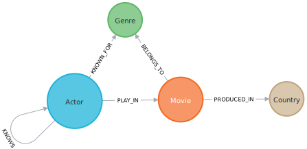

# TMDb to Neo4j

Used in [Hollywood Network Visualizer](https://github.com/stevenliatti/hollywood-network-visualizer).

Program reading the raw data in JSON from the TMDb collection and inserting them according to our needs in Neo4j. Made in Scala, use of [spray-json] libraries (https://github.com/spray/spray-json) for the deserialization of JSON and [neotypes] (https://neotypes.github.io/neotypes/), the Neo4j Scala driver based on the official Java driver. The programme is made up of six main steps:

1. Creating constraints on node types
2. De-serialisation of movies and actors in JSON in Scala case classes
3. Creation of `Map` and `Set` Scala from `Movie`s and `Actor`s to pre-process the relationships between the different nodes (parallel insertion of some data)
4. Adding all nodes in Neo4j, without relations
5. Added relationships between the nodes concerned from the collections created in 3.
6. The chosen algorithms are executed on the whole inserted data set.

Node and relationship insertions are done with the Neo4j query language, [Cypher](https://neo4j.com/developer/cypher-query-language/). Here you have the schema of nodes and relations created :



As an example, below are two Scala methods for inserting an actor and for inserting a relation of an actor playing in a movie :

```scala
def addActor(actor: Actor): Future[Unit] =
  driver.writeSession { session =>
    c"""
      CREATE (actor: Actor {
        tmdbId: ${actor.id},
        name: ${actor.name},
        biography: ${actor.biography.getOrElse("")},
        birthday: ${actor.birthday.getOrElse("")},
        deathday: ${actor.deathday.getOrElse("")},
        gender: ${actor.intToGender()},
        place_of_birth: ${actor.place_of_birth.getOrElse("")},
        profile_path: ${actor.profile_path.getOrElse("")}
      })
    """.query[Unit].execute(session)
  }
}

def addPlayInRelation(actor: PlayInMovie, movieId: Long): Future[Unit] =
  driver.writeSession { session =>
    c"""
      MATCH (m: Movie {tmdbId: $movieId})
      MATCH (a: Actor {tmdbId: ${actor.id}})
      MERGE (a)-[r:PLAY_IN {character: ${actor.character}, order: ${actor.order}}]->(m)
    """.query[Unit].execute(session)
  }
```
